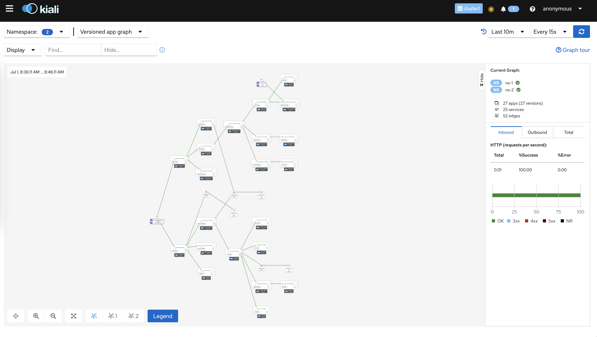
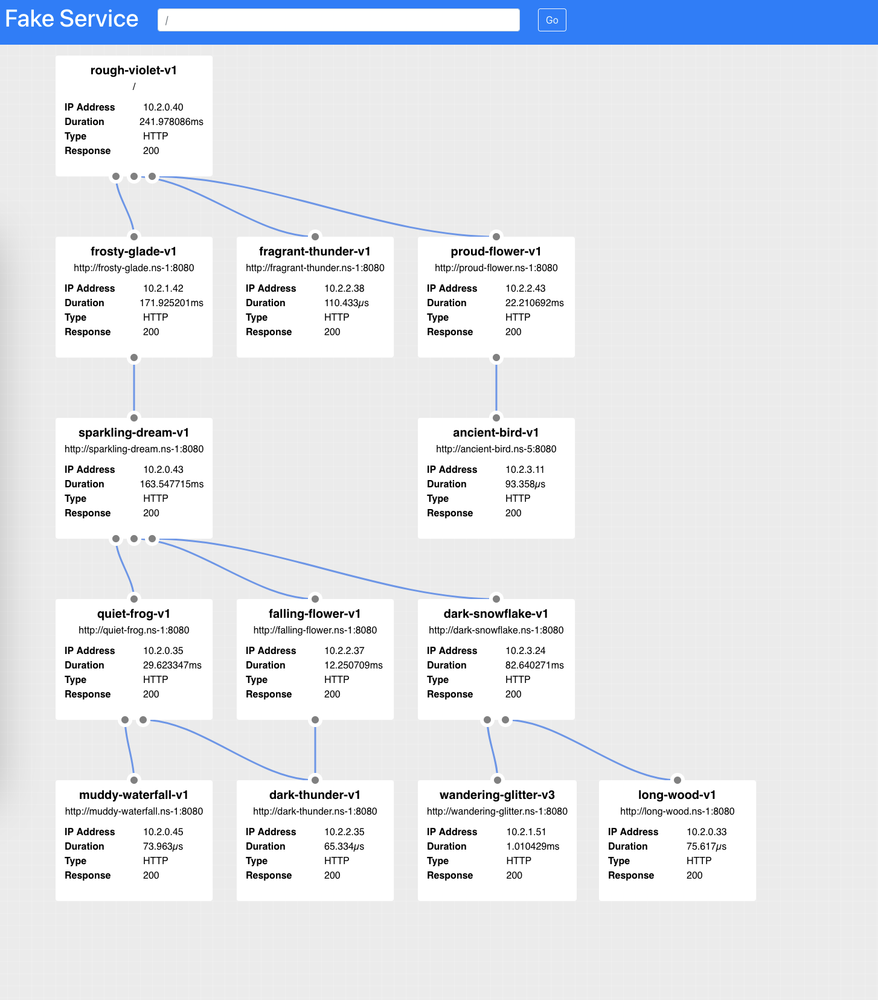

# istio-app-simulator generate

generate kubernetes yaml for applications



### Synopsis

This application generates kubernetes yaml that sets up complex application networks for a given amount of namespaces. 

```
generate [flags]
```

### Options

```
      --app-error-percent float32            If an application returns errors, what percent of requests should have errors? (0-1) (default 0.05)
      --apps-per-tier int                    Max amount of applications that can exist in a given tier. Will randomly pick between 1 < x (default 5)
      --chance-call-external int             Percent chance that a given application will make a call to an external service (0-100) (default 10)
      --chance-cross-namespace-chatter int   Percent chance that a given application will make a call to an application in another namespace (0-100) (default 10)
      --chance-of-app-errors int             Percent chance that a given application will return errors in their responses (0-100)
      --chance-version int                   Percent chance that a given application will have multiple versions v1/v2/v3 (0-100) (default 10)
  -h, --help                                 help for generate
      --hostname string                      Hostname to use for gateway and virtualService (default "*")
      --limits-cpu string                    Kubernetes container CPU limit
      --limits-memory string                 Kubernetes container memory limit
      --limits-proxy-cpu string              Kubernetes container CPU limit (default "2")
      --limits-proxy-memory string           Kubernetes container memory limit (default "1Gi")
  -n, --namespaces int                       Number of namespaces to generate applications for (default 1)
  -o, --output-dir string                    Output directory where assets will be generated (default "out")
      --requests-cpu string                  Kubernetes container CPU request (default "100m")
      --requests-memory string               Kubernetes container memory request (default "100Mi")
      --requests-proxy-cpu string            Kubernetes container CPU request (default "100m")
      --requests-proxy-memory string         Kubernetes container memory request (default "128Mi")
      --seed int                             Override random seed with static one (for deterministic outputs)
  -t, --tiers int                            Length of the application call stack per namespace (how many applications deep) (default 3)
      --timing-50-percentile string          50% of the requested calls should return within this range (default "5ms")
      --timing-90-percentile string          90% of the requested calls should return within this range (default "10ms")
      --timing-99-percentile string          99% of the requested calls should return within this range (default "20ms")
      --upstream-workers int                 Number of workers each application can utilize when calling upstream applications (default 10)
```

### Examples

* Overriding default values
```shell
./istio-app-simulator generate \
  # only generate 3 namespaces
  # namespaces are named ns-1, ns-2, ns-3
  --namespaces 3 \ 
  # 5 layer call stack in the namespace (app1-->app2-->app3-->app4-->app5)  
  --tiers 5 \
  # listen on istio-ingressgateway host foo.com
  # each namespace is available with the following prefix
  # foo.com/ns-1 foo.com/ns-2 foo.com/ns-3
  --hostname foo.com 
```

* Manipulating chances
```shell
./istio-app-simulator generate \
  # every application will call some external service
  --chance-call-external 100 \ 
  # half of all applications will call an application in another namespace
  # Calls are only made to applications in higher tiers to prevent circular dependencies
  --chance-cross-namespace-chatter 50 \
  # 10% of applications should have some form of error responses
  --chance-of-app-errors 10 \
  # of the 10% of apps that throw errors, return an error 1/4th of the time
  --app-error-percent 0.25
```

* Recreating an output - there are times you might want to recreate a users setup. All assets are labeled with a seed value. simply use the seed in your cmd
```shell
# Example namespace
# apiVersion: v1
# kind: Namespace
# metadata:
#   name: ns-1
#   labels:
#     istio-injection: enabled
#     seed: "1625582727962871000"

./istio-app-simulator generate \
  # use the seed above to regenerate the same output
  --seed 1625582727962871000
```

* Tuning Apps and sidecars
```shell
./istio-app-simulator generate \
    -o out/cluster-1 \
    --seed 100 \
    -n 3 \
    -t 7 \
    --apps-per-tier 10 \
    --hostname ias-cluster1.gke-test.solo.io \
    --requests-cpu "10m" \
    --requests-proxy-cpu "10m" \
    --timing-50-percentile 1ms \
    --timing-90-percentile 5ms \
    --timing-99-percentile 50ms \ 
    --upstream-workers 5
```


### Fake Service UI
You can reach a UI for the fake service call stack by using kubernetes port forwarding to the tier 1 service in the namespace
```shell
kubectl get svc -n ns-1 -l tier=1

kubectl port-forward svc/<tier—1-service> -n ns-1 9080:8080
```

